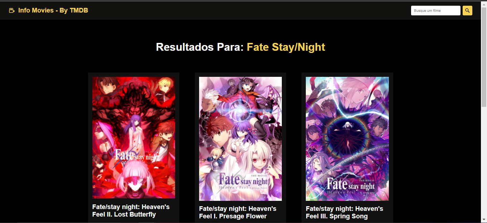

<h1 align = "center"> Olá, seja bem-vindo ao meu primeiro projeto React </h1>
 
<h2 align = "center"> Este é um site de informações de filmes feito com React usando a API do The Movie Database</h2>
 

 Neste projeto, os usuários podem acessar uma ampla gama de dados, incluindo sinopse, gênero, orçamento, faturamento, data de lançamento, idioma e uma variedade de outros detalhes fascinantes. A interface intuitiva e responsiva proporciona uma jornada cinematográfica personalizada, permitindo que os amantes do cinema mergulhem profundamente nas características de seus filmes favoritos. Descubra, explore e aprecie a riqueza de informações disponíveis sobre a sétima arte, tudo isso em um ambiente amigável e fácil de usar. 

 

 Abaixo você poderá ver algumas prints do projeto.

 
<h3 align = "center"> Info Movies - By TMDB</h3>
 

 
<h3 align = "center"> Exemplo de pesquisa de filmes</h3>
 

 

 
<h3 align = "center"> Página de um filme com os detalhes</h3>
 

 

 
